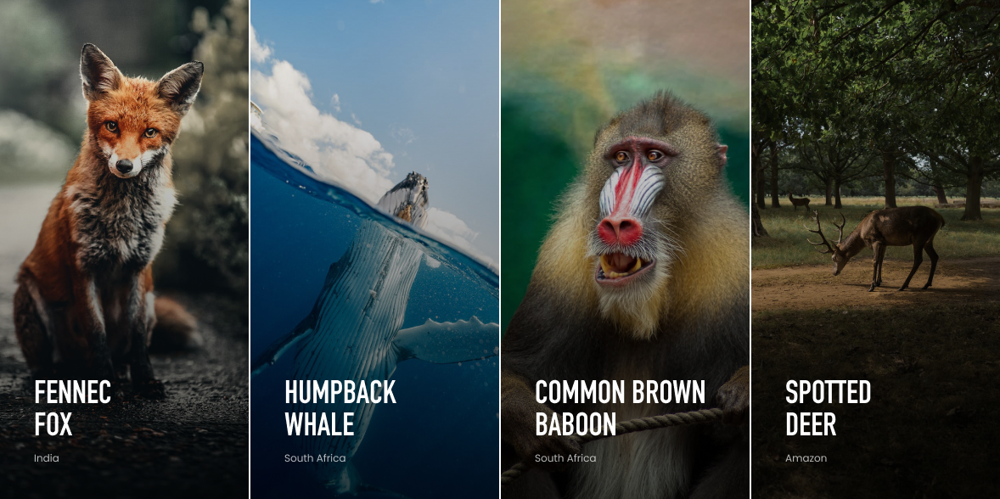
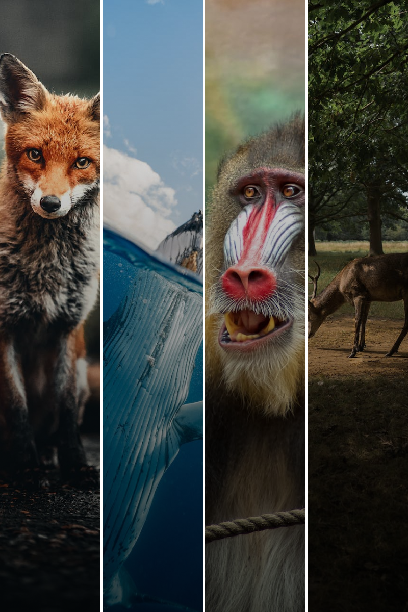

# 📗 Table of Contents

- [📖 About the Project](#about-project)
    - [🛠 Built With](#built-with)
        - [Tech Stack](#tech-stack)
        - [Key Features](#key-features)
        - [Approach](#approach)
    - [🚀 Live Demo](#live-demo)
- [💻 Getting Started](#getting-started)
    - [Setup](#setup)
    - [Prerequisites](#prerequisites)
    - [Install](#install)
    - [Usage](#usage)
    - [Run tests](#run-tests)
    - [Deployment](#triangular_flag_on_post-deployment)
- [👥 Authors](#authors)
- [🔭 Future Features](#future-features)
- [🤝 Contributing](#contributing)
- [⭐️ Show your support](#support)
- [🙏 Acknowledgements](#acknowledgements)


# 📖 [Interactive Photo Gallery App] <a name="about-project"></a>

### Figma design (desktop view)


### Figma design (mobile view)


**[Interactive Photo Gallery]**  This is simple webpage displaying different photos in a gallery. I work seamlessly for both desktop and mobile devices.
## 🛠 Built With <a name="built-with"></a>

### Tech Stack <a name="tech-stack"></a>

<details>
  <summary>Client</summary>
  <ul>
    <li><a href="https://developer.mozilla.org/en-US/docs/Web/JavaScript">Javascript</a></li>
    <li><a href="https://developer.mozilla.org/en-US/docs/Web/HTML">HTML</a></li>
    <li><a href="https://developer.mozilla.org/en-US/docs/Web/CSS">Plain CSS</a></li>
    <li><a href="https://webpack.js.org/">Webpack</a></li>
  </ul>
</details>


### Key Features <a name="key-features"></a>

- **Displays photos like in gallery**
- **Displays image subject and location**
- **Uses smooth transition for better user experience**
- **Full-size view interaction through modal**
- **Responsive design**


<p align="right">(<a href="#readme-top">back to top</a>)</p>


### Approach to Solve the Problem <a name="approach"></a>

1. Render basic UI with images and its text overlay.
2. Add transition to move text overlay upwards and simultaneously using `opacity` magic to reveal `Know more` button on hoover action.
3. Use `css properties` to gray-out, blur, scale-up and decrease brightness of the image on hoover action.
4. Add modal to display full-size image on `Know more` button click event.
5. Close modal on `close` button click event.


## 🚀 Live Demo <a name="live-demo"></a>
Click [here](https://interactive-photo-gallery-khaki.vercel.app/) to view a live demo of the project.


<p align="right">(<a href="#readme-top">back to top</a>)</p>


## 💻 Getting Started <a name="getting-started"></a>


To get a local copy up and running, follow these steps.

### Prerequisites

In order to run this project you need:

1. [Nodejs](https://nodejs.org/en)
2. Any browser of your choice
3. Desired Code Editor


### Setup

Clone this repository to your desired folder:

```sh
  cd my-folder
  git clone https://github.com/edenlisk/interactive-photo-gallery.git
```

### Install

Install all dependencies for this project with:

```sh
  cd my-folder
  npm install
```
### Usage

To run the project in development mode, execute the following command and open `http://localhost:8080` in your browser to view the project.

```sh
  npm run dev
```


### Deployment

You can build this project for production by using this command:

```sh
    npm start
```

<p align="right">(<a href="#readme-top">back to top</a>)</p>

## 👥 Authors <a name="authors"></a>

👤 **Edenlisk**

- LinkedIn: [@edenlisk](https://www.linkedin.com/in/nsanzimfura-enock-nkumbuyedeni/)
- GitHub: [@Edenlisk](https://github.com/edenlisk)
- X.com (former Twitter): [@Edenlisk](https://twitter.com/nkumbuyedeni)


<p align="right">(<a href="#readme-top">back to top</a>)</p>


## 🔭 Future Features <a name="future-features"></a>

[comment]: <> (> Describe 1 - 3 features you will add to the project.)

- **Re-order of photos using drag en drop functionality**
- **Upload new photos and save them to database**
- **Photo manipulation functionalities such as crop and add custom texts**

<p align="right">(<a href="#readme-top">back to top</a>)</p>


## 🤝 Contributing <a name="contributing"></a>

Contributions, issues, and feature requests are welcome!

Feel free to check the [issues page](https://github.com/edenlisk/interactive-photo-gallery/issues).

<p align="right">(<a href="#readme-top">back to top</a>)</p>


## ⭐️ Show your support <a name="support"></a>

[comment]: <> (> Write a message to encourage readers to support your project)

If you like this project kindly consider giving ⭐

<p align="right">(<a href="#readme-top">back to top</a>)</p>

## 🙏 Acknowledgments <a name="acknowledgements"></a>

[comment]: <> (> Give credit to everyone who inspired your codebase.)

I would like to thank [Code Africa](https://www.codeafrica.co/) who provided the task details and [figma design](https://www.figma.com/design/XF6xlvvHBv12WFveDjVoso/COA-Take-home-Challenge?node-id=1-482&t=YPq0HtowQthKPEw2-0).

<p align="right">(<a href="#readme-top">back to top</a>)</p>
